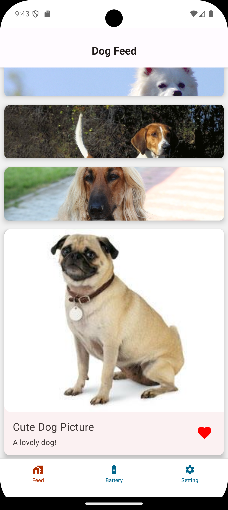

# Clariti Expo App 👋

A simple Dog Feed app built using React Native with Light / Dark Mode Support that meets accessibility standards.

|  |  |

| Left is iOS | Right is Android |

---

## Setup Instructions

### 1. Install Dependencies

Clone the repository and install the dependencies using npm:

```bash
npm install
```

### 2. Start the Application

Run the following command to start the Expo development server:

```bash
npx expo start --clear
```

In the output, you'll find options to open the app in:

- Development Build
- Android Emulator
- iOS Simulator

Press 'i" to launch iOS Simulator or "a" to launch Android Simulator

### 3. Development

- Begin development by editing files inside the `app` directory. This project uses file-based routing for navigation.
- API is store outside of `app` folder
- Store is store outside of `app` folder

---

## Performance Optimization Strategies

### FlatList Optimization

- The app leverages React Native’s `FlatList` optimizations such as `initialNumToRender` and `removeClippedSubviews` to efficiently render large lists.

### RTK Query Caching

- Data fetching is optimized with Redux Toolkit’s **RTK Query**, which caches responses and minimizes redundant network requests.

### Memoization

- Components utilize React’s `useMemo` and `React.memo` to avoid unnecessary re-renders, ensuring smooth performance.

### 60 FPS on the Feed

- The Feed has been optimized to avoid uncecessary reneder and images has been cache for fastest performance.

---

## Future Performance Optimization Strategies

### Image Caching

- For image-heavy screens like the Feed, a libraries like [`react-native-fast-image`](https://github.com/DylanVann/react-native-fast-image) could improved caching and performance.

### Font in Theme Provider

- Currently we are using default font with different bolding, size, underline. Later in the future we can expand Font to

### Feed can be further optimized

- There are certin funciton can be futher optimized using `useCallBack` to avoid any unnecessary re-render.

---

## Assumptions and Trade-offs

### Assumptions

- The app assumes a stable network connection for data fetching.
- Default theming and navigation structures will cover most use cases.
- The app uses a free API to fetch images instead of storing assets locally.
- Adding the bottom navigation

### Trade-offs

- Some performance optimizations (e.g., advanced image caching) are deferred until scaling necessitates them. Right now, RTK Query handles API caching effectively, but as the app scales, additional image optimization strategies will need to be considered.
- Early design decisions, such as the theme layer, assume this is a single application and will not be a white-label product. As a result, the ThemeProvider currently supports only dark and light mode, without built-in support for custom branding.

## Ideas for Future Improvements

### Enhanced Theming

- Introduce dynamic theme switching based on the OS. If user is on dark mode in the OS, the app will use CustomDarkTheme.

### Accessibility

- Improve **accessibility features**, such as enhanced screen reader support.

### Feature Expansion

- Plan for future like telemety of the user

---

## Learn More

To dive deeper into developing with Expo, check out these resources:

- **[Expo Documentation](https://docs.expo.dev/)** – Learn fundamentals or advanced topics with detailed guides.
- **[Learn Expo Tutorial](https://docs.expo.dev/tutorial/planning/)** – A step-by-step tutorial for building projects that run on Android, iOS, and the web.
